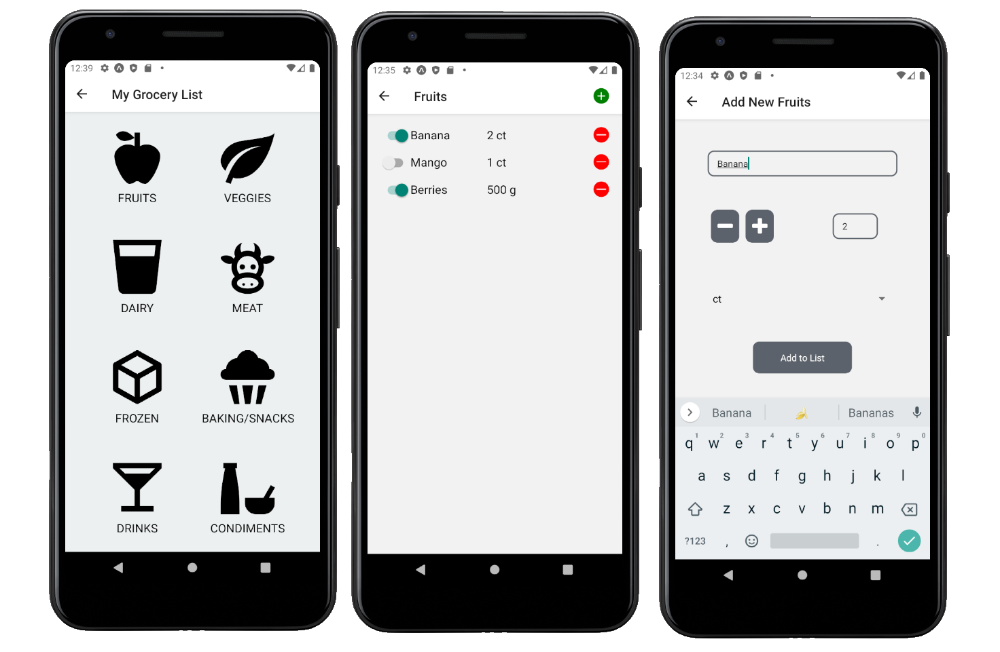

# MyGroceryApp

This project was made for all the grocery shoppers that needs a tool to organize their shopping list and share it among friends. 

🛠 Built with React Native, Expo, GraphQL, AWS Amplify, Amplify DataStore, AWS AppSync



### Features

- 👮‍ Authenticated
- 🔥 Serverless back end
- 🚀 GraphQL
- 👻 Offline and delta sync capabilities

## Architecture Overview

To deploy the backend of this app, I chose to use Amplify.
> AWS Amplify is an end-to-end solution that enables mobile and front-end web developers to build and deploy secure, scalable full stack applications, powered by AWS.

With Amplify, I was able to add Authentification to my app with AWS Cognito, build a GraphQL API that interacts with DynamoDB and add DataStore to offer offline synchronization.

Here is an overview of the architecture deployed to allow offline synchronization:


This architecture allowed me to only interact with the DataStore API using standard JavaScript function invocations. 

## GraphQL Schema

```graphql
type Product @model {
  id: ID!
  name: String!
  checked: Boolean!
  unit: String!
  quantity: Int!
  category: String!
  groceryList: GroceryList @connection(name: "GroceryListProducts")
}

type GroceryList @model {
  id: ID!
  name: String!
  owner: User @connection(name: "UserGroceryLists")
  description: String
  products: [Product] @connection(name: "GroceryListProducts")
}

type User @model {
  id: ID!
  name: String
  email: String
  grocerylists: [GroceryList] @connection(name: "UserGroceryLists")
}
```

## Deploy the App

### Prerequisites

In order to run this app, make sure the following dependencies are installed in your computer:

* [Node.js](https://nodejs.org/en/)
* [Git](https://git-scm.com/)
* [Expo CLI](https://docs.expo.io/get-started/installation)
* [iOS](https://docs.expo.io/workflow/ios-simulator) or [Android](https://docs.expo.io/workflow/android-studio-emulator) simulator
* [Amplify CLI](https://github.com/aws-amplify/amplify-cli#install-the-cli)

### Deploy the back end

1. Clone the repo & install the dependencies

```sh
~ git clone https://github.com/hmisonne/Amplify_GroceryApp.git
~ cd Amplify_GroceryApp
~ npm install
```

2. Initialize the Amplify project

Run the following commands and make sure you have access to an AWS account:

```sh
~ amplify init
? Enter a name for the environment: dev (or whatever you would like to call this env)
? Choose your default editor: <YOUR_EDITOR_OF_CHOICE>
? Do you want to use an AWS profile? Y
```

3. Deploy the backend to your AWS account

```sh
~ amplify push
? Are you sure you want to continue? Y
? Do you want to generate code for your newly created GraphQL API? N
> We already have the GraphQL code generated for this project, so generating it here is not necessary.
```

### Update the API and models

1. Update the amplify project
```sh
~ amplify update api
~ amplify push
```

2. Update the DataStore
```sh
~ npm run amplify-modelgen
```

### Run the front end on your local machine

Start the app

```sh
~ npm start
```


## Resources

Category icons : https://iconify.design/icon-sets/mdi/
Styled Buttons: https://icons.expo.fyi/
AWS AppSync Resources: https://aws.amazon.com/appsync/resources/
Point of Sale app: https://github.com/amazon-archives/aws-appsync-refarch-offline
Amplify doc: https://docs.amplify.aws/lib/q/platform/js